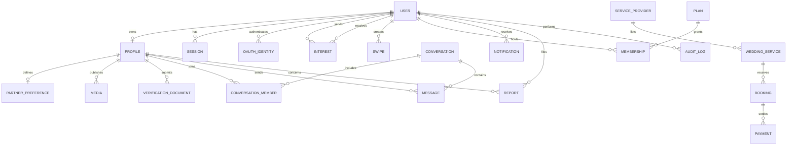

# Core data model

The schema enforces identity and relationship integrity through UUID foreign keys, unique constraints for profile ownership and interest/swipe pairs, and query-aligned indexes. PII documents retain only encrypted object keys; their bytes belong in private object storage, never in PostgreSQL.
